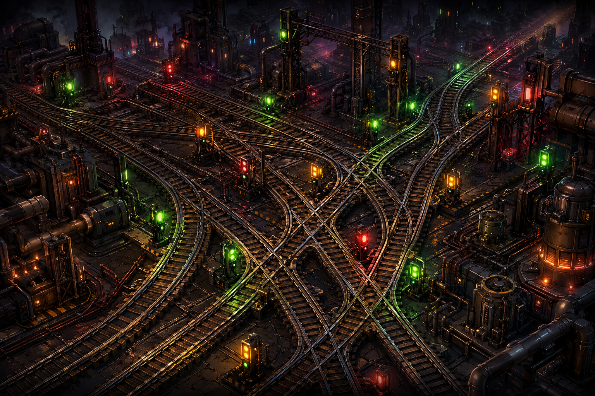
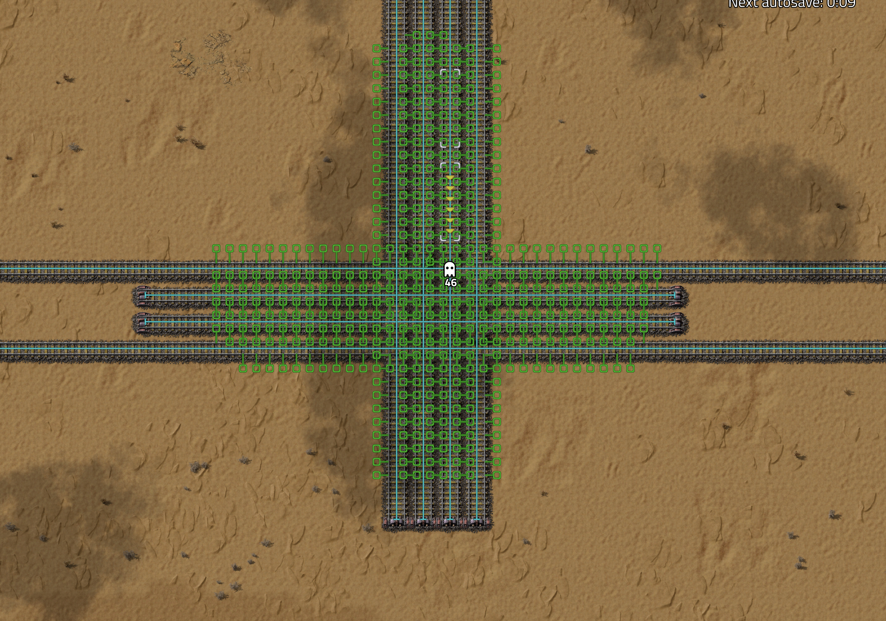
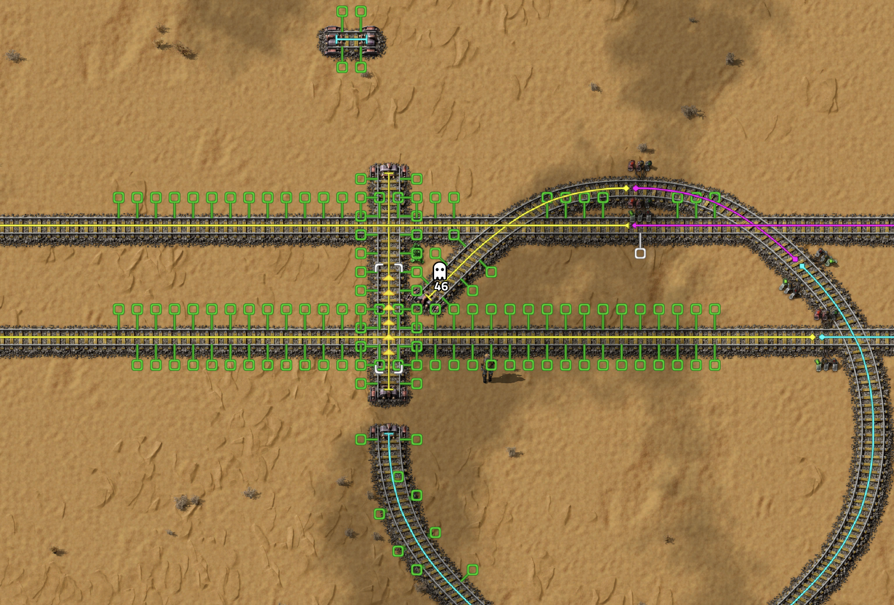

# Space Efficient Rail Signals

**Place rail signals (almost) anywhere — even on the tightest intersections.**

## What It Does

By default, Factorio prevents placing rail signals on tracks that are too close together — the signal collision mask overlaps the adjacent rail, making placement impossible. This mod decouples the collision masks of **Rail Signals** and **Chain Signals** from Rails, so you can place them freely regardless of rail spacing.

Typical use cases:
- Dense multi-lane intersections where default signals won't fit
- Compact train hubs with minimal tile spacing
- Converting a Left-Hand Drive network to Right-Hand Drive (or vice versa) when signals can't be placed conventionally

## How It Works

In `data-final-fixes.lua`, the mod detects every collision layer that signals share with rails, registers new signal-only collision layers, and reassigns signal collision masks to those new layers. Rails keep their original masks; only signals are changed. Works automatically for **any modded signals** as well.

## Factorio 2.0

This mod targets **Factorio 2.0** (version `1.1.0`+). It covers all rail types introduced in 2.0:

| Type | Notes |
|---|---|
| `straight-rail` | Standard rail |
| `curved-rail-a` / `curved-rail-b` | Replaced old `curved-rail` |
| `half-diagonal-rail` | New in 2.0 |
| `elevated-*` variants | Space Age DLC |
| `legacy-straight-rail` / `legacy-curved-rail` | Backward-compatibility rails |

For Factorio 1.1, use version **1.0.4**.

## Installation

### Mod Portal
Search for **Space Efficient Rail Signals** on [mods.factorio.com](https://mods.factorio.com) and click Install.

### Manual
Download `Space-Efficient-Rail-Signals_1.1.0.zip` from the [Releases](https://github.com/StevenLi-phoenix/Space-Efficient-Rail-Signals/releases) page and place it in your Factorio `mods/` folder.

## Compatibility

The mod automatically detects and adjusts any modded signal whose type name matches `rail-signal` or `rail-chain-signal`.

**Optional dependencies** (soft — mod works without them):
- [Rail Signal Planner](https://mods.factorio.com/mod/RailSignalPlanner) — useful companion for automatic signal placement
- `cargo-ships`, `KNF_Realistic_Electric_Trains_fix`, `space-exploration-postprocess`

**Note:** The mod may not play well with other mods that heavily modify entity collision masks at the same data stage.

## Disclaimer

The mod author takes no responsibility for any problems or difficulty with debugging intersections made using this mod. Use at your own risk for complex or unusual intersection designs.

## Credits

Original mod by **WristWatch / OceanPhantom**.
Factorio 2.0 port by **StevenLi-phoenix**.
